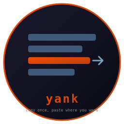

# yank

  [](https://github.com/isene/fe2o3)

Clipboard history that pastes back where you were.



Two halves in one binary. A recorder sits on X selection events and
writes every copy to `~/.yank/hist/`. A picker lists them newest
first; Enter puts the one you chose into the window you came from.
No tray icon, no daemon that polls, nothing running between copies.

<br clear="left"/>

## Usage

```sh
yank --watch           # the recorder, once per session (autostart it)
yank                   # the picker
yank --paste-to XID    # picker; Enter pastes into window XID
```

In the picker: `↑ ↓` or `j k` select, `Enter` pastes, `d` deletes the
entry, `q` quits.

The intended way in: a key that opens the picker in a terminal and
remembers the window that had focus. With tile:

```
exec /home/geir/bin/yank --watch
bind Mod4+v exec /home/geir/bin/yank-pop
```

where `yank-pop` is the two-line script in this repo's `bin/`.

## How the paste works

Enter makes yank own both CLIPBOARD and PRIMARY with the entry, then a
detached helper refocuses the target window (an EWMH
`_NET_ACTIVE_WINDOW` message, which tile honours) and sends one
Shift+Insert through XTEST. Terminals paste PRIMARY on that key, most
other X apps CLIPBOARD; owning both makes the same keystroke work in
either. The helper runs after the picker's own terminal has closed, so
the keystroke never lands in the picker.

## Why not copyq

copyq worked until it did not: its selection-sync helpers hang under a
terminal that owns selections itself, pile up by the dozen, and its
process swarm filled the X server's XFixes subscription table so no
other clipboard tool could subscribe. yank is one process at idle,
woken only by XFixes when a selection changes.

## Battery

The recorder blocks in `wait_for_event`. A copy costs one event, one
`ConvertSelection`, one small file write. Idle: zero.

## Requirements

Linux, X11 with XFixes, `xclip` (to hold the selections after the
picker exits) and `xdotool` (for the paste keystroke).

## Install

```sh
cargo build --release
ln -s "$PWD/target/release/yank" ~/bin/yank
cp bin/yank-pop ~/bin/
```

## License

Public domain (Unlicense).
